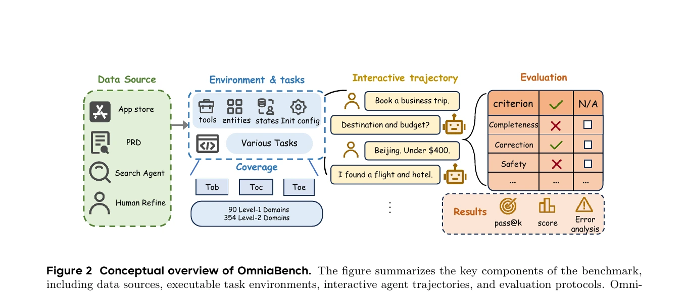
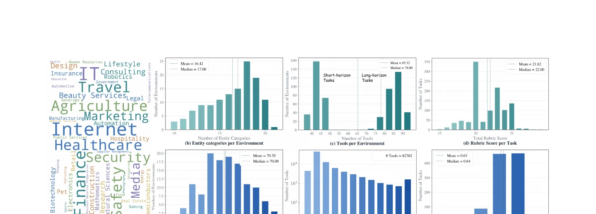
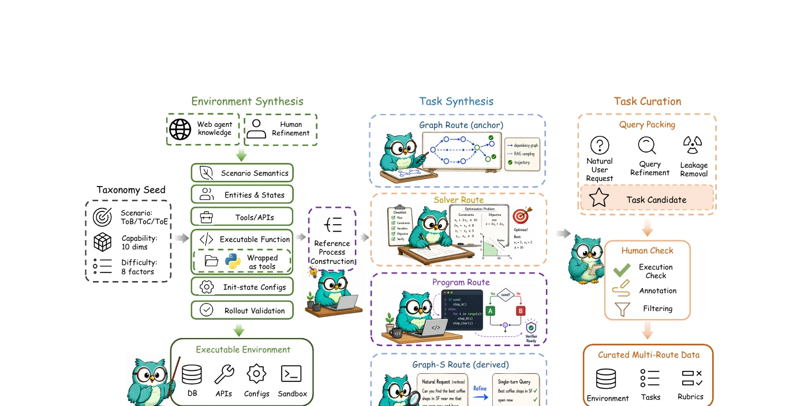

<div align="center">

#  OmniaBench

**Benchmarking General AI Agents Across Diverse Scenarios**

[](https://scuuy.github.io/OmniaBench/)
[](https://arxiv.org/abs/2607.14989)
[](https://huggingface.co/datasets/scuuy666/OmniaBench)
[](#citation)

</div>

## 🔔 News

- 📄 **[2026-07]** Our paper is released on arXiv!
- 🚀 **[2026-07]** The OmniaBench codebase and dataset are released!

<p align="center">
  
</p>

OmniaBench is a broad, diagnostic benchmark for evaluating general AI agents. Scenario knowledge is
distilled from app stores, product documents, industry resources, and web retrieval into a hierarchical
taxonomy spanning **ToC, ToB, and ToE** with **90 level-1 and 354 level-2 domains**. On top of this
taxonomy we build executable environments and synthesize tasks through four complementary construction
routes, then score every trajectory along a **ten-dimensional capability taxonomy** and **eight atomic
difficulty factors**.

The full collection contains **1,431 tasks**; a **644-task challenging subset** is released for cost-efficient,
contamination-resistant leaderboard evaluation. Even frontier models find it hard: Claude-Sonnet-5 and
GPT-5.6-Sol top the leaderboard with Overall Pass@1 of only **58.54%** and **57.14%**, respectively.

## 📊 Leaderboard (challenging subset, Pass@1)

<p align="center">
  
</p>

| Rank | Model | Access | DAG | Solver | Program | DAG-S | Overall |
|---|---|---|---|---|---|---|---|
| 1 | Claude-Sonnet-5 | Closed | 57.34 | 56.67 | 63.33 | 60.50 | **58.54** |
| 2 | GPT-5.6-Sol | Closed | 55.37 | 65.00 | 50.00 | 59.00 | 57.14 |
| 3 | GLM-5.2 | Open | 54.80 | 26.67 | 60.00 | 69.00 | 56.83 |
| 4 | GPT-5.5 | Closed | 54.80 | 38.33 | 60.00 | 64.50 | 56.52 |
| 5 | DeepSeek-V4-Pro | Open | 52.54 | 36.67 | 53.33 | 63.50 | 54.50 |
| 6 | Claude-Opus-4.7 | Closed | 53.39 | 43.33 | 63.33 | 57.50 | 54.19 |
| 7 | Kimi-K2.6 | Open | 49.72 | 45.00 | 63.33 | 57.50 | 52.33 |
| 8 | Qwen3.7-Max | Closed | 48.59 | 51.67 | 66.67 | 48.50 | 49.69 |

See the [paper](https://arxiv.org/abs/2607.14989) for the complete benchmark and the
[project page](https://scuuy.github.io/OmniaBench/) for the interactive leaderboard and analyses.

## ✨ Highlights

- **Broad scenario coverage** — 90 level-1 / 354 level-2 domains grounded in real app stores, PRDs, and industry taxonomies across consumer, business, and employee-facing settings.
- **Four complementary construction routes** — DAG (multi-turn, stateful tool-chain execution), DAG-S (single-turn tasks derived from DAG via query refinement), Solver (selection / scheduling / allocation / optimization), and Program (procedural reasoning with branching, iteration, and execution debugging).
- **Diagnostic evaluation, not just pass/fail** — a ten-dimensional capability taxonomy (Task Understanding, Information Gathering, Planning & Decision Making, State Management, Tool Use, Code & Programmatic Operations, Data Analysis, Office & Document Handling, Interactive Collaboration, Reliability & Safety) and eight atomic difficulty factors enable fine-grained analysis beyond a single aggregate score.
- **Rubric- and code-based scoring** — DAG / DAG-S / Solver tasks are judged against weighted rubric checklists; Program tasks use binary `VerifyCode` verification.
- **Reproducible evaluation harness** — a model-agnostic runner, four-route orchestrator, and scoring pipeline are provided under [`evaluation/`](evaluation/), portable across OpenAI-compatible and Anthropic-native providers.

## 📦 Data construction

<p align="center">
  
</p>

Domain knowledge collected by a web agent is calibrated through human refinement, then translated into
instantiable Python environments with entities, states, tools, and initialization configs. Tasks are
synthesized on top of these environments through four routes:

| Route | Description | Challenging subset |
|---|---|---|
| **DAG** *(anchor)* | Multi-turn, stateful interaction over sampled tool-dependency chains | 354 |
| **DAG-S** *(derived)* | Single-turn tasks obtained by query-refining DAG tasks | 200 |
| **Solver** | Selection, scheduling, allocation, and optimization scenarios | 60 |
| **Program** | Procedural reasoning with branching, iteration, and task-program synthesis | 30 |

The challenging subset (644 tasks) is a fixed, curated slice of the full 1,431-task collection, selected to
reduce evaluation cost and mitigate contamination risk after public release while preserving domain coverage.

## 🚀 Quick start

Requires **Python 3.10+**.

```bash
git clone https://github.com/scuuy/OmniaBench.git
cd OmniaBench
python -m venv .venv && source .venv/bin/activate
pip install -r evaluation/requirements.txt
```

### 1. Configure your models

```bash
cp evaluation/configs/profiles.example.json evaluation/configs/profiles.json  # declare which models play agent / user-simulator / rubric-judge
cp evaluation/.env.example evaluation/.env                                    # fill in the API keys/base URLs, never commit this file
```

`profiles.json` only stores *environment variable names*; the actual keys and base URLs go in `.env`. See [evaluation/README.md](evaluation/README.md) for the full config reference.

### 2. Run evaluations

```bash
python evaluation/scripts/orchestrate_eval.py \
  --profile openai_compatible \        # profile name defined in configs/profiles.json
  --routes route1 route2 route3 route4 \  # which of the 4 routes to run; omit to run all
  --pass-k 1 \                         # run each task k times, report pass@k
  --max-task-workers 8                 # concurrent task workers
```

The first run automatically downloads the 644-task dataset from [Hugging Face](https://huggingface.co/datasets/scuuy666/OmniaBench)
into `evaluation/data/` if it's not already there — no separate download step needed. Pass `--no-download`
to disable this (e.g. offline environments), and use `--data-override route_id=/path` to point a route at
your own local copy instead.

Results are written to `evaluation/results/`. More flags (resuming a run, filtering by `global_id`/language, overriding data paths, computing multi-dimensional scores and visualizations, etc.) are documented in [evaluation/README.md](evaluation/README.md).

## 📁 Repository layout

```text
evaluation/  Reproducible evaluation runners, route orchestration, and scoring
website/     Next.js project page deployed to GitHub Pages
```

The 644-task route files are hosted on [Hugging Face](https://huggingface.co/datasets/scuuy666/OmniaBench)
(not committed to this repo, since the files are tens of MB each) and are downloaded automatically the
first time you run an evaluation — no manual download step needed. The filesystem sandbox assets needed
by Route 1 are small enough to be committed directly, under `evaluation/runtime_assets/fs_bundle/`.

## 👥 Team

OmniaBench is developed by the Huawei Cloud Post-Training Team and PKU DCAI Team, in collaboration with
Renmin University of China, Beijing Institute of Technology, and Tsinghua University. See the
[paper](https://arxiv.org/abs/2607.14989) for the full author list and acknowledgments.

## 📚 Citation

```bibtex
@misc{shen2026omniabenchbenchmarkinggeneralai,
      title={OmniaBench: Benchmarking General AI Agents Across Diverse Scenarios},
      author={Chengyu Shen and Yujie Fu and Gangtao Xin and Yanheng Hou and Wenlong Fei and Guojie Zhu and Jiawei Li and Hongcheng Gao and Runming He and Zhen Hao Wong and Meiyi Qiang and Hao Liang and Zhao Cao and Hao Jiang and Chong Chen and Wentao Zhang},
      year={2026},
      eprint={2607.14989},
      archivePrefix={arXiv},
      primaryClass={cs.CL},
      url={https://arxiv.org/abs/2607.14989},
}
```

## 📄 License

Code: [Apache License 2.0](LICENSE)  
Dataset: See [Hugging Face dataset card](https://huggingface.co/datasets/scuuy666/OmniaBench)
